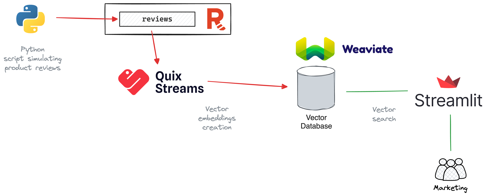

# Real-time Vector Embedding Pipeline

This is a real-time data pipeline that creates vector embeddings in a vector database by consuming data from a Redpanda topic.

## Use case 

TBD

But, at a high-level, this solution ingests any textual data in real-time, creates embeddings for them, and allows users to perform semantic searching on them.

For example, marketing team analyzing product reviews made on an e-commerce store.

Let's refine the use case as we go.

## Architecture

The solution consists of:
- **Python script** - Simulates the product reviews customers made on an e-commerce website and produce them to a Redpanda topic.
- **Redpanda** - Ingests product review events into the `reviews` topic from the Python producer.
- **Quix** - Consumes the `reviews` topic, converts them into text embeddings, and writes them to the vector database.
- **Vector database** - Stores vector embeddings and allows client-facing applications to perform vector search on them.
- **Streamlit application** - User-facing application that allows users to type in queries in natural language and search the vector database.

